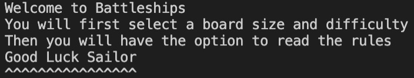
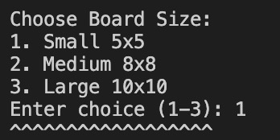
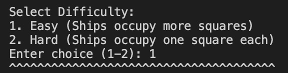
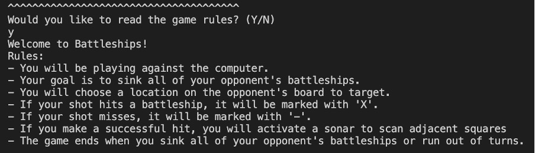
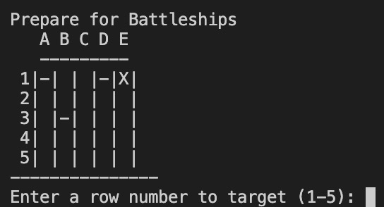
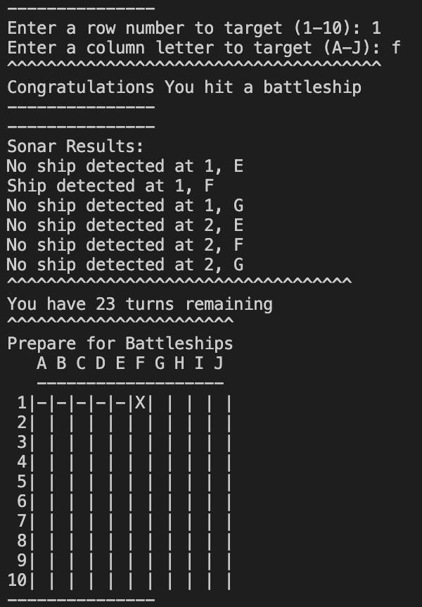
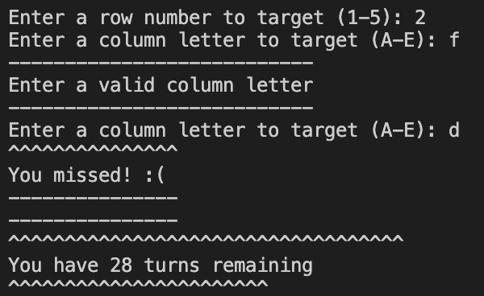

Welcome Alex Hebbes,

This is the Code Institute student template for deploying your third portfolio project, the Python command-line project. The last update to this file was: **August 17, 2021**

## Reminders

* Your code must be placed in the `run.py` file
* Your dependencies must be placed in the `requirements.txt` file
* Do not edit any of the other files or your code may not deploy properly

## Creating the Heroku app

When you create the app, you will need to add two buildpacks from the _Settings_ tab. The ordering is as follows:

1. `heroku/python`
2. `heroku/nodejs`

You must then create a _Config Var_ called `PORT`. Set this to `8000`

If you have credentials, such as in the Love Sandwiches project, you must create another _Config Var_ called `CREDS` and paste the JSON into the value field.

Connect your GitHub repository and deploy as normal.

## Constraints

The deployment terminal is set to 80 columns by 24 rows. That means that each line of text needs to be 80 characters or less otherwise it will be wrapped onto a second line.

-----
Happy coding!

# Battleships Game 

The intention was to make a Battleships Game using python. This project is targetted at someone looking to play a strategy game. The aim of the game is to allow the user to play a familiar game with the addition of a new feature, the sonar, which will help them to complete the game on harder levels or if they are new to the game. There is also a contact form on the website in case users have any comments for improvements which could be made. The user will have options to decide what side board they play on and what level of difficulty they desire.

## Contents
- [How To Play](#how-to-play)
- [User Experience](#user-experience-ux)
    - [User Stories](#user-stories)
- [Features](#features)
    - [Existing Features](#existing-features)
    - [Future Features](#future-features)
- [Technologies Used](#technologies-used)
    - [Languages](#languages)
    - [Programmes Used](#programmes-used)
- [Testing](#testing)
    - [PEP8 Linter](#pep8-linter)
    - [Invalid Inputs](#invalid-inputs)
    - [Terminal Testing](#terminal-testing)
    - [Fixed Bugs](#fixed-bugs)  
- [Deployment](#deployment)
- [Credits](#credits)
    - [Acknowledgements](#acknowledgements)

## How To Play 

The user is playing against the computer, aiming to sink all the computer's battleships before the turns run out. 
In this version, the computer is the only player with 'ships' the limited turns create the difficulty for the user. 
When the player misses a shot this is indicated by a - symbol on the board they see. 
When the player succesfully hits a ship this is marked by an X symbol. 
To make the game a bit different to ones the player has played before there is a sonar function. 
The sonar is triggered after a successful hit. It scans the adjacent squares and feedsback if there are any ships nearby. 
The player wins if they hit all the opponents ships before the turns run out. 

## User Experience (UX)

- ### User Stories

1. As a user I want to play a game which uses some strategy.  
    
2. As a user I want to be able to select the difficulty and size of the game. 

3. As a user I want to know if I won or lost when the game is over.  
    
4. As a user I want to know how many turns I have left as I play the game. 
    

## Features 

### Existing Features 

**Pregame Options**

- The user is welcomed to the game and given initial guidance on what will come. 

- The user is told that they will first select a board size and difficulty level before having the option to view the rules. 

**Initial Game Type Selections**

- The user has the choice of three board sizes which helps them to have a game which suits their skill and level and time availability. 

- The user is then prompted to select a difficulty level. They are also given guidance on what the difficulty means. 

**Rules Option**

- The user is given the option to read the rules of the game

- If they select to see the rules the rules are displayed after which the game begins. If they selcet to not see the rules the game begins. If they make an invalid selection the game begins. 

**Game Play**

- The user sees the board above. Hits are marked by an X and misses by a - . 

- When the user makes a successful hit a congratulations message is diplayed. 

- Below this the sonar results are shown. 

- The number of remaining turns is displayed and the game board is updated for the next turn. 

- When the player misses, a message is displayed to indicate this. 

-The remianing turns are displayed. 

- The board is updated with a - symbol and the game is ready for the next turn. 

- At various points in the game the user is required to make inputs. When an invalid input is made the game indicates this to the user. 

- If an invalid input is made during the game, a message is displayed which prompts the user to make a valid input. 

- If the invalid input occurs outside of gameplay then a message is displayed that the input was incorrect and the game defaults to beginning the game e.g. At board selection, if an invalid input is made, the message is displayed that the input was invalid and that the board size will default to a small board and the game begins. 

**Game Page**

-The game page continues the colour theme from the home page and is laid out simply so that younger users are able to intuitively use the page. 

-The score at the top updates when a question is answered correctly. 

- The question updates each time an answer button is clicked. 

- The three answer buttons are laid out below the question and when clicked, will update the score if necessary. Also, the user will see either a tick or cross displayed after they click a button dependent on their success with the question. 

- At the bottom of the page is a 'Return Home' link which directs the user back to the home page. 

**Game End Modal**

- The 'Game End Modal' is displayed once the final question has been answered. 

- The user sees their final score and gets feedback based on their score. 

- There is a return home button at the bottom of the modal. The text is a darker colour than the rest of the modal to draw attention of the user. 

### Features left to implement 

- The site could be developed to include more quizzes and have more emphasis on teaching. 

- There could also be different sections of the site based upon the user's attainment level. 

- Another useful feature would be a top scores section, or a way for a user's top score to be saved so that they can try to beat their previous attempts. 

## Technologies Used
### Languages

- HTML
- CSS
- JavaScript

### Programmes Used

- Balsamiq
    -For Wireframes
- Git 
    - Used for version control
- Github
    - Used to store the repository for the project.
- Gitpod
    - The IDE used when coding the website. 
- Chrome Developer Tool
    - Used to check responsivity and to troubleshoot issues
- Am I Responsive
    - This site was used to check the responsiveness of the site (https://ui.dev/amiresponsive)
- Goodle Fonts
    - The fonts for the site were taken from Google Fonts

## Testing

The code was validated through the W3C HTML Validator, W3C CSS Validator, and JSHint. These were used to ensure that syntax errors or omissions were rectified prior to submission.
 - (https://validator.w3.org/)
 - (https://jigsaw.w3.org/css-validator/)
 - (https://jshint.com/)

HTML Validation
 - The HTML passed the validator with no issues. 

 CSS Validation
 - The CSS validator highlighted a couple of issues in relation to syntax, for example an extra bracket was included and needed removing. Following these changes the CSS passed the validator. 

JS HINT 
- JSHint highlighted a number of missing semi-colons and also a string that was being read as a variable because it did not have inverted commas around it. With these fixes made the JavaScript passed the validator. 

### Lighthouse 

The first lighthouse test came back with the following scores. 

 

Accessibility was improved by a changing of colours on the site to improve readability. The pink question boxes on the game page were made a darker shade and the text on question box and answer buttons was made into a brighter yellow. This provided better contrast and so improved readability. 

 

There was also an issue with the home button, which was a font-awesome home icon. Lighthouse flagged this as an issue in relation to aria-hidden. I tried a few fixes suggested online, for example placing hidden text so that a screen reader could still read the text and the icon could remain as the only visible feature of the button. These still did not improve the issue, so I replaced the icon with text. I will have to do some more work to figure out this problem and why it occured. 

 

### Devices 
- The site was tested on both **Chrome** and **Safari**
- Devices used were iPhone SE, MacBook Air and iPad. 

### Testing User Stories

1. As a user I want to test my use of their, there, or they're in a number of contexts. 
    - There are ten questions, each is a sentence with one word missing. The questions are a mixture of direct speech, and declarative statments. 

2. As a user I want to have support with the spellings of the target words so that I can see the words to embed the spelling, whilst practising the use of the words in context. 
    - There are three button options and the target words are displayed throughout. 

3. As a user I want to know how well I did on the game. 
    - There is a score counter at the top of the game page which updates as the game is played. There is also a final score displayed on the game end modal. 

4. As a user I want to know how I am doing without looking at the score counter after each question. 
    - There is a green tick or red cross displayed after each answer guess, dependant upon the user's success with the question. 

### Fixed Bugs

- There was an error displaying in the console when the page was loaded. To rectify this I added an event listener to allow the DOM content to load prior to the running of the rest of the JavaScript. 

- There was an issue with the contact modal screen on modal devices, the page overflowed to the left of the screen but could not be accessed. Initially I was unsure what was causing the issue, but found it to be the textarea in the end. To fix this I changed the box-sizing in the media query, and this resolved the issue. 

### Functionality

- All buttons were tested and are accessible. 
- All buttons have been tested to ensure they react as expected when hovered over. 
- The game works as intended. 
- All modals work as intended and when teh user exits them, they return to the home page view as expected. 

### Future Features

- The inclusion of a progress bar, could be a good feature in the future. 
- Additional quizzes which test different skills would also enhance the site. 

## Deployment 

- The project was deployed to Github Pages and used the following steps: 

1. Sign in to GitHub and access the [repository](https://github.com/A-Hebbes/spelling-game)
2. Go to settings which can be found towards the top of the repository page. 
3. Once in settings, scroll down to Github Pages.
4. Select the source as main. 
5. Now click save and refresh the page. 

## Credits 

Code help and advice came from many sources. 

**Ollie Grubb**

Ollie has helped build my understanding of a variety of areas in relation to this project. He has helped in particular with the bug-fixing process. His guidance helped me to use the Dev Tools more effectively. His assistance has also been credited in the code. 
 

**Video Guides**

- Modals 
The use of modals was totally new to me and so the following video proved a useful introduction to their use(https://www.youtube.com/watch?v=KjQ8uvAt9kQ)

- General structure and approach 
The following video was a useful scaffold in the early stages of the project. It helped outline some key principles and gave inspiration for structure (https://www.youtube.com/watch?v=f4fB9Xg2JEY)

**Educational Sites and Fora**

Listed below are more sites that I used to gain understanding of issues I was having or insights into best practice. 

(https://coolors.co/)

(https://www.labnol.org/beautifier/)

(https://www.thoughtco.com/)

(https://stackoverflow.com/)

(https://www.w3schools.com/)

(https://forum.freecodecamp.org/)

(https://nekocalc.com/px-to-rem-converter)

(https://webflow.com/blog/fonts-for-web-design)

### Content

  
- Font Awesome (https://fontawesome.com/)
- Google Fonts (https://fonts.google.com/)
