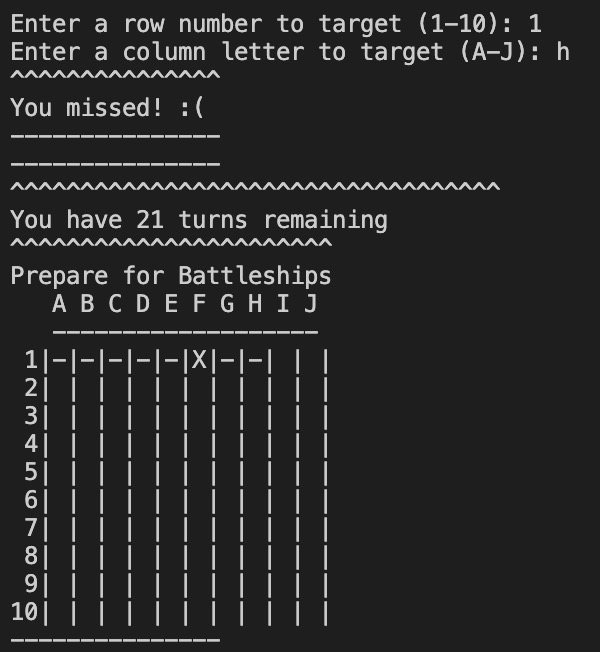

# Battleships Game 

The intention was to make a Battleships Game using python. This project is targetted at someone looking to play a strategy game. The aim of the game is to allow the user to play a familiar game with the addition of a new feature, the sonar, which will help them to complete the game on harder levels or if they are new to the game. There is also a contact form on the website in case users have any comments for improvements which could be made. The user will have options to decide what side board they play on and what level of difficulty they desire.

## Contents
- [How To Play](#how-to-play)
- [User Experience](#user-experience-ux)
    - [User Stories](#user-stories)
- [Features](#features)
    - [Existing Features](#existing-features)
    - [Future Features](#future-features)
- [Technologies Used](#technologies-used)
    - [Languages](#languages)
    - [Programmes Used](#programmes-used)
- [Testing](#testing)
    - PEP8 Linter
    - Invalid Inputs
    - Terminal Testing
    - Fixed Bugs
    - Testing User Stories
- [Deployment](#deployment)
- [Credits](#credits)

## How To Play 

The user is playing against the computer, aiming to sink all the computer's battleships before the turns run out. 
In this version, the computer is the only player with 'ships' the limited turns create the difficulty for the user. 
When the player misses a shot this is indicated by a - symbol on the board they see. 
When the player succesfully hits a ship this is marked by an X symbol. 
To make the game a bit different to ones the player has played before there is a sonar function. 
The sonar is triggered after a successful hit. It scans the adjacent squares and feedsback if there are any ships nearby. 
The player wins if they hit all the opponents ships before the turns run out. 

## User Experience (UX)

### User Stories

1. As a user I want to play a game which uses some strategy.  
    
2. As a user I want to be able to select the difficulty and size of the game. 

3. As a user I want to know if I won or lost when the game is over.  
    
4. As a user I want to know how many turns I have left as I play the game. 
    

## Features 

### Existing Features 

**Pregame Options**

- The user is welcomed to the game and given initial guidance on what will come. 

- The user is told that they will first select a board size and difficulty level before having the option to view the rules. 

**Initial Game Type Selections**

- The user has the choice of three board sizes which helps them to have a game which suits their skill and level and time availability. 

- The user is then prompted to select a difficulty level. They are also given guidance on what the difficulty means. 

**Rules Option**

- The user is given the option to read the rules of the game

- If they select to see the rules the rules are displayed after which the game begins. If they selcet to not see the rules the game begins. If they make an invalid selection the game begins. 

**Game Play**

- The user sees the board above. Hits are marked by an X and misses by a - . 

- When the user makes a successful hit a congratulations message is diplayed. 

- Below this the sonar results are shown. 

- The number of remaining turns is displayed and the game board is updated for the next turn. 

- When the player misses, a message is displayed to indicate this. 

-The remianing turns are displayed. 

- The board is updated with a - symbol and the game is ready for the next turn. 

- At various points in the game the user is required to make inputs. When an invalid input is made the game indicates this to the user. 

- If an invalid input is made during the game, a message is displayed which prompts the user to make a valid input. 

- If the invalid input occurs outside of gameplay then a message is displayed that the input was incorrect and the game defaults to beginning the game e.g. At board selection, if an invalid input is made, the message is displayed that the input was invalid and that the board size will default to a small board and the game begins. 

### Future Features 

- The game could be developed further to have a the computer take shots against the player. 

- Giving the player a visible board and the option to place their own ships would also be a future feature of benefit.  

## Technologies Used
### Languages

- Python

### Programmes Used

- Github
    - Used to store the repository for the project.
- Gitpod
    - The IDE used when coding the game. 
- Online IDE
    - I used this during testing to run the game and see if any issues showed (https://www.online-ide.com/)
- Render.com 
    - This site was used for deployment (https://render.com/)

## Testing

The code was run through a PEP8 Linter (https://pep8ci.herokuapp.com) which showed some issues with line lengths, whitespace, and not having enough lines separating some part sof the code. Once these issues had been resolved there were no issues found with the code. 

I used invalid inputs while playing the game through to check that this did not create any unexpected issues. 

The game was tested in my local terminal and on an Online IDE website (https://www.online-ide.com/) and on the deployed version of the game at (https://battle-ships-game.onrender.com/)

### Testing User Stories

1. As a user I want to play a game which uses some strategy.  
    - The game allows the player to use some strategy when playing, this is enhanced by the sonar function which allows the player to rely on more than just luck when playing on harder levels.  

2. As a user I want to be able to select the difficulty and size of the game. 
    - The user is offered options of board size and difficulty level at the beginning of the game.  

3. As a user I want to know if I won or lost when the game is over.
    - The end of the game features a message to indicate either a win or a loss. 

4. As a user I want to know how many turns I have left as I play the game. 
    - After each turn the number of remaining turns is displayed. 

### Fixed Bugs

- There was an issue with the check game end function. It was caused by an indentation error. Once the indentation was fixed the bug was resolved. 

- At game end there was an issue that the player wasn't informed that the game was over. This was because the if statement for game end was reliant on the turns being equal to zero. I changed this to be less than or equal to zero and this fixed the issue and displayed the game end message.  

## Deployment 

- The project was deployed to On Render the steps to deploy are as below: 

1. Sign in to GitHub and access the [repository](https://github.com/A-Hebbes/battle-ships-game)
2. Clone or fork the repository 
3. Navigate to Render.com (https://render.com/)
4. Click new and then select web service 
5. Search the forked/cloned repo and click connect
6. Apply the relevant settings and environment variables
7. Select Auto-deploy
8. The site will now be deployed

## Credits 

**Knowledge Mavens Youtube**

I used a video to guide me through an initial build of a simple game of battleships. Using this guidance, I developed the game further to ensure that the game was my own work. The video I used can be found at the following link. (https://www.youtube.com/watch?v=tF1WRCrd_HQ) 
 

**Chat GPT**

- I used ChatGPT to help guide me in the process. At various stages, I used the site to help add detail and explanation to error messages. I also used the site to help develop my knowledge of the programming possibilities, for example ChatGPT helped to explain Python's formatted string literals (f-strings). I used this knowledge to help display accurate information to the user of ship positions in the sonar. 

**Mentor**

My mentor Simen Daehlin provided useful guidance on seeking support from Conde Institute. This project coincided with a period of considerable personal hardship. Simen advised me to seek extra time for the project which was vital for project completion and my own well-being. 

**Code Institute**

A number of staff at Code Institute have helped in the complettion of this project. 

- Student Support were instrumental in facilitating the extra time I needed for this project. 

- Tutor support helped with deployment. I was unable to access Heroku and it looked like I would not be able to submit, but tutor support gave me the guidanc to use the Render website instead, which has worked for deployment. 
